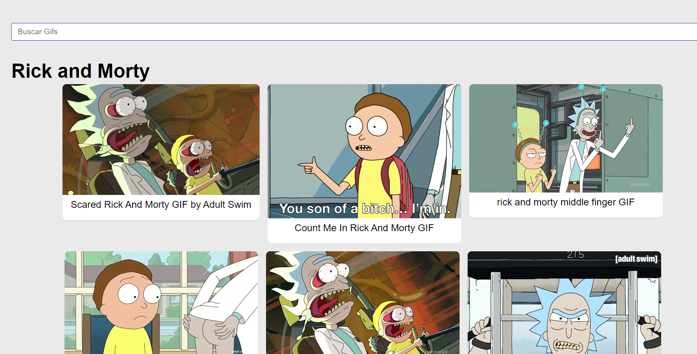
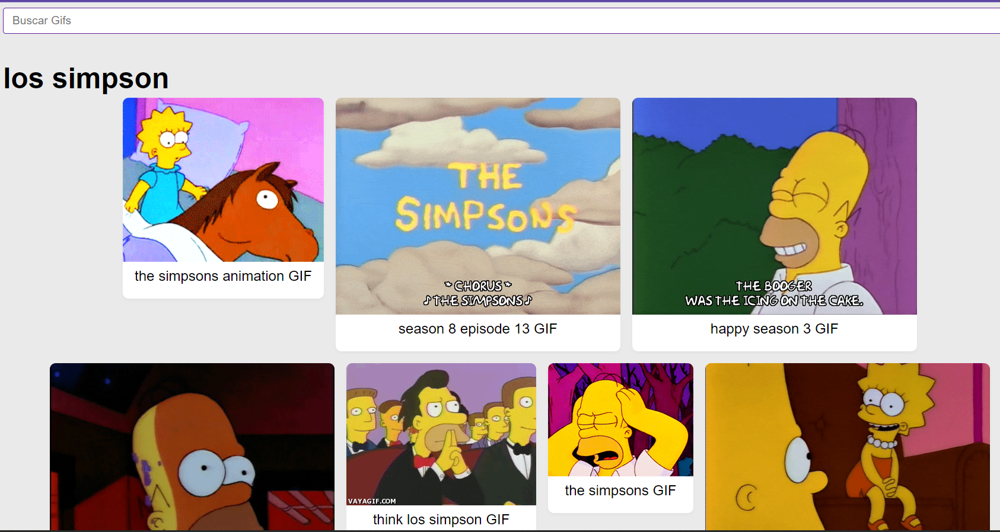
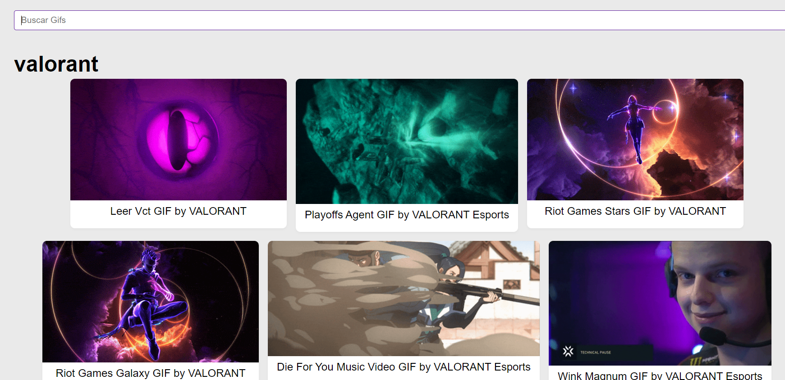

<h2>Temas puntuales:</h2>

<ul>
 <li>Custom Hooks</li>
 <li>Fetch hacia un API</li>
<li>Comunicación entre componentes</li>
 <li>Clases de CSS</li>
 <li>Animaciones</li>
<li>Enviar métodos como argumentos</li>
<li>Crear listados</li>
 <li>Keys</li>
 <li>Giphy</li>
 <li>Seguir el camino de las pruebas</li>
 <li>Pruebas en componentes específicos</li>
 <li>Pruebas en componentes de forma individual</li>
 <li>Pruebas con customHooks</li>
 <li>Esperar cambios en un customHook</li>
 <li>Simular eventos en inputs y formularios</li>
 <li>Simular llamadas a funciones</li>
 <li>Evaluar si existen elementos en el componente</li>
</ul>

Aplicacion para buscar Gifs hecha con React + customHooks. 
